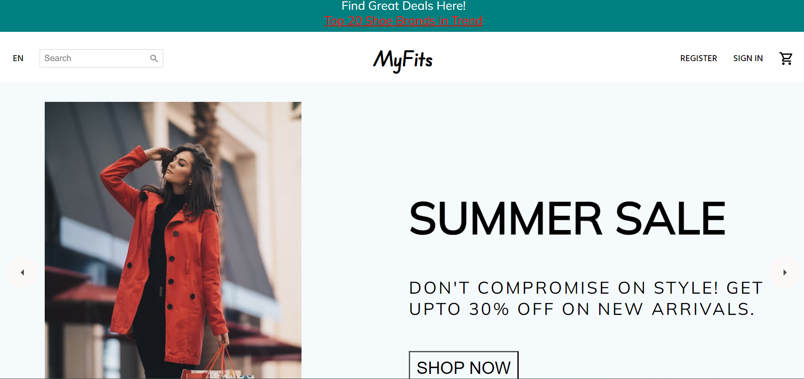
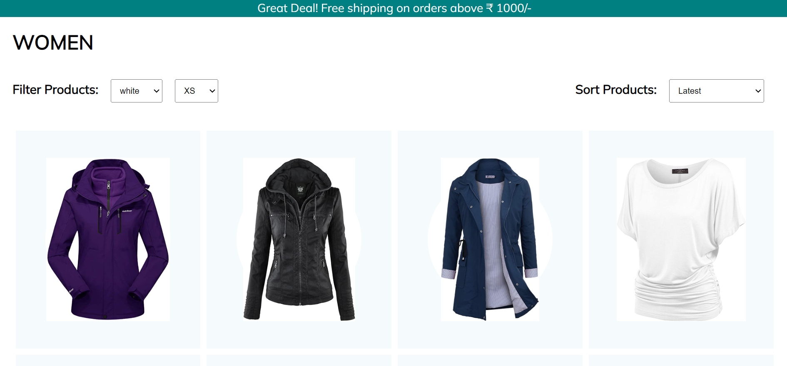
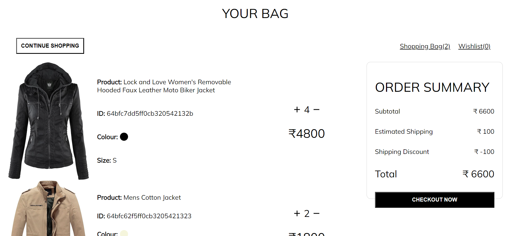
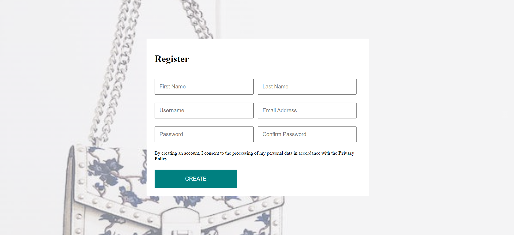

# MyFits

## E-commerce Frontend

Welcome to the MyFits E-commerce App! This ReactJS-based frontend is designed to provide an engaging shopping experience.

## Project Overview

MyFits is an e-commerce platform built with **ReactJS**, **CSS3**, and **Redux-Toolkit**. It offers a user-friendly interface for browsing products, managing the shopping cart, and making secure purchases which is handled by **Stripe**. The combination of ReactJS and Redux ensures a dynamic and responsive application state, providing a seamless experience for users.

## Screenshots

Explore some screenshots from the MyFits E-commerce Frontend.

_Home Page_

_Wide Range of Categories_

_Some of the Products_

_Checkout Page_

_Sign-up Page_

_Sign-in Page_
